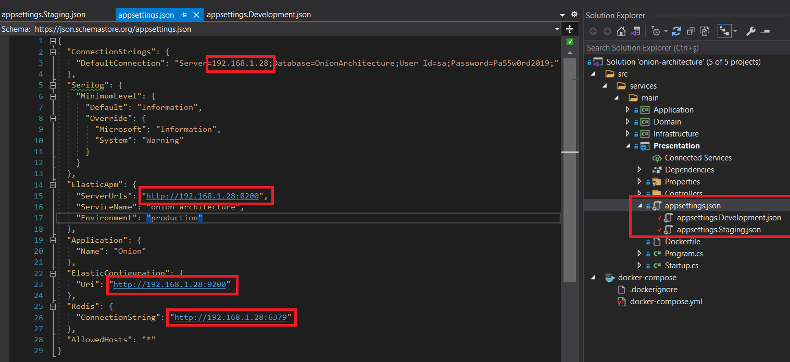
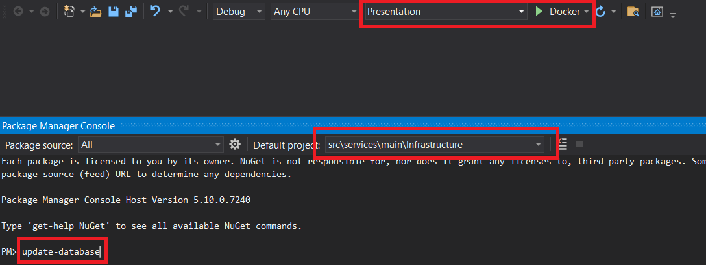

Getting Started
1. If you don't have Docker, download it from the address below.  
https://www.docker.com/products/docker-desktop
3. Download this repository
4. Open onion-architecture.sln with Visual studio
5. Configure settings on images
(set your own ip addresses)
7. 
8. 
9. Set startup project as docker-compose
10. Start

- If you like or are using this project to learn or start your solution, please give it a star. Thanks! :star:
- Do consider endorsing me on LinkedIn for ASP.NET Core - [Connect via LinkedIn](https://www.linkedin.com/in/fatihyildirim1o) 🦸

## Support

If you are having problems, please let us know by [raising a new issue](https://github.com/fatihyildirim1o/aspnet-starter-kit/issues/new).

## License

This project is licensed with the [MIT license](https://github.com/fatihyildirim1o/aspnet-starter-kit/blob/master/LICENSE.txt).

